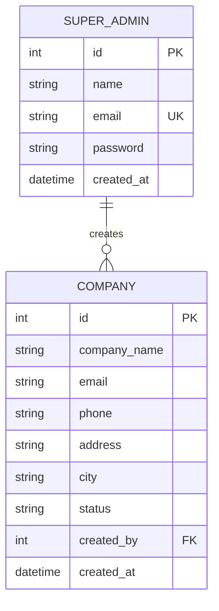

Bahut simple! Sirf Super Admin aur Company - bas do tables:

## Simple ERD (Only 2 Tables):

```
┌────────────────┐       ┌────────────────┐
│   SUPER_ADMIN  │       │    COMPANY     │
│                │       │                │
│ - id (PK)      │──────◄│ - id (PK)      │
│ - name         │  1:N  │ - name         │
│ - email        │creates│ - address      │
│ - password     │       │ - phone        │
│ - created_at   │       │ - email        │
└────────────────┘       │ - created_by(FK)│
                         │ - created_at   │
                         └────────────────┘
```

## Mermaid Diagram:



## Table Structure:

### SUPER_ADMIN Table
| Column | Type | Description |
|--------|------|-------------|
| id | INT (PK) | Unique ID |
| name | VARCHAR(100) | Super Admin name |
| email | VARCHAR(100) (UK) | Login email |
| password | VARCHAR(255) | Password |
| created_at | DATETIME | When added |

### COMPANY Table
| Column | Type | Description |
|--------|------|-------------|
| id | INT (PK) | Unique company ID |
| company_name | VARCHAR(200) | Company name |
| email | VARCHAR(100) | Company email |
| phone | VARCHAR(20) | Contact number |
| address | TEXT | Full address |
| city | VARCHAR(100) | City |
| status | ENUM | Active/Inactive |
| created_by | INT (FK) | Super Admin ID |
| created_at | DATETIME | Creation date |

## SQL Code:

```sql
-- Super Admin table
CREATE TABLE super_admin (
    id INT PRIMARY KEY AUTO_INCREMENT,
    name VARCHAR(100) NOT NULL,
    email VARCHAR(100) UNIQUE NOT NULL,
    password VARCHAR(255) NOT NULL,
    created_at TIMESTAMP DEFAULT CURRENT_TIMESTAMP
);

-- Company table (created by Super Admin)
CREATE TABLE company (
    id INT PRIMARY KEY AUTO_INCREMENT,
    company_name VARCHAR(200) NOT NULL,
    email VARCHAR(100),
    phone VARCHAR(20),
    address TEXT,
    city VARCHAR(100),
    status ENUM('active', 'inactive') DEFAULT 'active',
    created_by INT NOT NULL,
    created_at TIMESTAMP DEFAULT CURRENT_TIMESTAMP,
    FOREIGN KEY (created_by) REFERENCES super_admin(id)
);
```

## Example Data:

**Super Admin:**
```
id: 1
name: "Rahul Sharma"
email: "rahul@admin.com"
password: "hashed_password"
```

**Companies created by Super Admin:**
```
id: 101
company_name: "ABC Traders"
email: "info@abctraders.com"
created_by: 1  (Rahul Sharma)

id: 102
company_name: "XYZ Solutions"
email: "contact@xyzsolutions.com"
created_by: 1  (Rahul Sharma)
```

## Relationship:
- **One Super Admin** → **Many Companies**
- Super Admin can create multiple companies
- Each company knows which Super Admin created it

Ye sabse simple structure hai - sirf Super Admin aur Company ke saath!